The Idea of Improving Indonesian Colloquial Lexicon Through Fuzzy Matching Approach
================

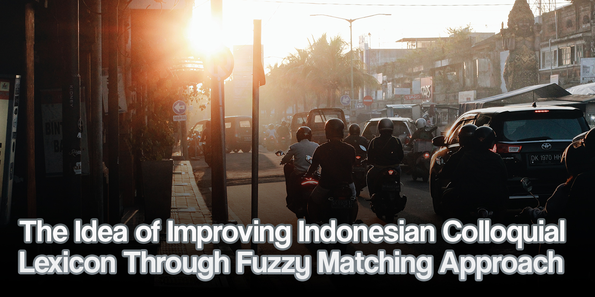

Asset illustration by [Wijaya Kusuma](https://unsplash.com/@wijayakusuma?utm_content=creditCopyText&utm_medium=referral&utm_source=unsplash) on [Unsplash](https://unsplash.com/photos/people-riding-motorcycle-on-road-during-daytime-Bz2hBLVWwGU?utm_content=creditCopyText&utm_medium=referral&utm_source=unsplash)

> *Yuo might notcie taht this sentnece have many mispeled words, but yuo can raed it proprelly dsepite teh msispeillgns, couldn’t you?*
> 

It first came from the meme which claimed that as long as the first and last letters are correct we can read any jumbled words. There never was a Cambridge researcher though, but there is some science underlying why we can read that particular jumbled text. One of the findings is that because the whole text is reasonably easy to predict [1]. As it is valid for humans, can a computer aka machine read the same text as we do?

# Word correction

In a nutshell, the word correction algorithm works by comparing input words against a predefined dictionary or language model. If a word appears to be misspelled based on certain rules, the algorithm then suggests its corresponding corrections. The word correction algorithm should, at least, have three components: language model, potential candidate, and selection criterion. Every misspelled word has its potential “correct” word candidates which are sourced from its corresponding language and valued by certain selection criteria.

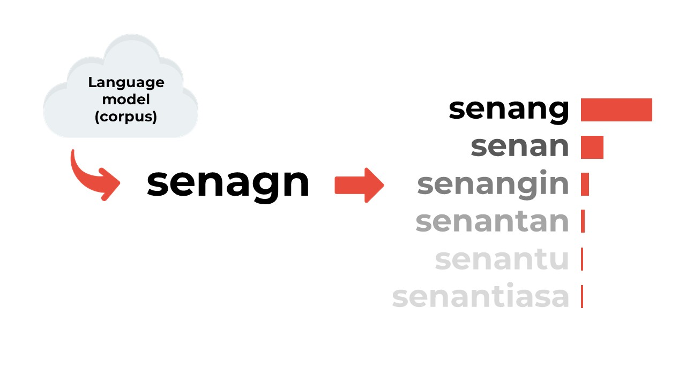

Word correction algorithm, illustrated

Fuzzy string matching is an existing successful concept that is used as the foundation part of word correction algorithms. The word "fuzzy" itself means a flexible or tolerant approach, allowing for similarities and approximations rather than rigid, exact matches. In the context of fuzzy string matching, the algorithm considers the fuzziness or imprecision in the comparison of strings, accommodating variations like typos or slight differences.

# Natural Language Processing (NLP) for Bahasa Indonesia

Currently, Natural Language Processing (NLP) for Bahasa Indonesia, the Indonesian language, has been making progress, but it might not be, in my opinion, as advanced or well-developed as NLP resources for some other major languages like English. Though the Indonesian NLP community has existed and grown since the first time it got me interested back then in 2020, any breakthroughs in NLP, such as transformer models like BERT and GPT, have initially been focused on languages with large user bases, like English.

As someone interested in this particular field, there are still many aspects that can be improved for NLP Bahasa Indonesia. Shout out to the founder of [IndoNLP](https://indonlp.com/) who pioneered the NLP for Bahasa Indonesia, you truly inspired many people including myself!

# Developing a new algorithm

So, I, am a curious person who’d like to try to combine existing algorithms with the hope it would yield better results. Here is my approach: first, create a mapping of potentially similar words, calculate their string similarity afterward, and finally return the supposed-to-be word for each word in each mapping. Before going any further, let's take a quick look at some of the basics.

## Phonetic similarity

In the linguistics field, phonetics is a study of how people produce and perceive sounds. Phonetic similarity is a method to identify words or phrases that sound alike but may have different spellings. How it works is instead of looking at the exact spelling of words, it focuses on the sounds represented by the words. These algorithms aim to identify words with similar pronunciations. Some of the most common phonetic algorithms include Soundex, Metaphone, Double Metaphone, Beider-Morse, and NYSIIS.

Particularly in this project, I specifically choose the Double Metaphone algorithm. The reason is that it is easy to learn and deploy, also it can be applied to languages other than English. In contrast to the Soundex algorithm which are based purely on English, the Double Metaphone algorithm is said to be able to be used for languages other than English as well [2]. Although no proven study shows that the algorithm works well with Bahasa Indonesia, various studies and final assignments exist and already utilized this method for phonetic similarity tasks.

For example, let’s take a look below.

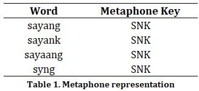

All of the words above have the same metaphone key though their spelling is different from each other. The correct spelling is the topmost word that is *sayang*, which translates into love in English. As you can guess, the other spellings have the same meaning as *sayang*, but why? In Bahasa Indonesia, people tend to type certain words differently than their original form to imply the writer’s style of typing or even emotion. The word *sayank* (letter substitution) implies cuteness, *sayaang* (vocal elongation) implies clinginess, and *syng* (abbreviation) implies laziness. There are many other spell-altering methods such as affixation, anaptyxis, and monophthongization [3]. Using the Double Metaphone algorithm, those group of words with potentially similar meanings is expected to be captured.

## String similarity

String similarity is any measure of how similar any two sequences of characters are [4]. String similarity is useful for determining how phonologically close any two words are and can also calculate their morphological relatedness. Phonological similarity can be addressed by the edit distance method, while q-gram and cosine similarity can be utilized to calculate morphological similarity. As I am still a newbie in NLP and linguistics study, kindly correct me if I used these terms incorrectly :)

![Cosine similarity, illustrated in a 2-dimensional plane [5].](asset/cosine-similarity-2d.jpg)

Cosine similarity, illustrated in a 2-dimensional plane [5].

Cosine similarity measures the similarity between two vectors by calculating the cosine of the angle between the two vectors [5]. Suppose a string can be represented as a vector, we can compare any two strings by calculating the angle between their respective vector representations. The most common vector encoding methods are tf-idf and bag-of-words encoding. For instance, bag-of-words encoding turns strings into the n-dimensional vector of counting numbers representing how frequently each word is in that string (or letters in words). Let’s revisit our example above.

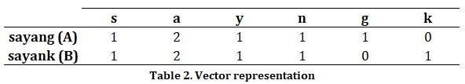

Plugging it into the cosine similarity formula

$$
\begin{align*} \text{CosineSimilarity(\pmb{A},\pmb{B})}&=\dfrac{\pmb{A}\cdot\pmb{B}}{\|\pmb{A}\|\times\|\pmb{B}\|}\\&= \dfrac{[1,2,1,1,1,0]\cdot[1,2,1,1,0,1]^T}{\|[1,2,1,1,1,0]\|\times\|[1,2,1,1,0,1]\|}\\&=\dfrac{7}{(2.8284)(2.8284)}\\&=0.875 \end{align*}
$$

The result is the words *******sayang******* and *******sayank are******* 87.5% similar based on cosine similarity. Here is the similarity matrix for all of the words in the example above.

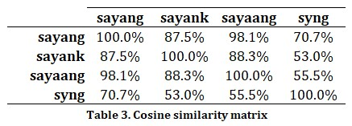

As you can see, cosine similarity has a symmetrical attribute, meaning the similarity of A to B is as equal to B to A.

## The algorithm

Here is how my algorithm works:

1. For an arbitrary set of documents (corpus), create a mapping of Metaphone keys using the Double Metaphone algorithm.
2. For each word mapping with a member count more than one:
    1. Calculate a Cosine similarity matrix
    2. Assign the most frequent word as the supposed-to-be word
    3. Get the similarity for the remaining word compared to the selected word in step 2b
    4. Eliminate words with a similarity score that is less than an arbitrary threshold (hyperparameter)
    5. Return the selected word in step 2b as the final result

The expected output is as follows (using the previous example):

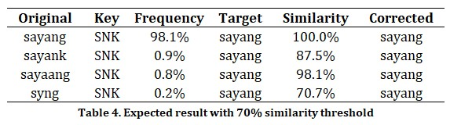

# Practical implementation

For research sake, to evaluate whether my algorithm is useful or not in an NLP manner, I decided to test it out with text classification analysis. There are a plethora of options to choose from, yet I chose this analysis because it is familiar to me (or at least during I wrote this article). To begin with, I’m not going to explain the detailed step-by-step of the analysis, because yeah that's not the main point of this article. So, let’s dive into it!

## Google Play review data

Initially, I sought a binary text classification dataset, and after a long day of surfing the internet, I finally got the idea to do some explorations in  Google Play review data. For simplicity, I didn’t want to do much data preprocessing other than the necessary text preprocessing step, so I chose the KAI Access application which has a pretty low rating and plenty of negative reviews. By doing this, I expect the target classes to be balanced (or at least near to) so I can use them instantly. To make the target classes a binary, I assigned reviews with rating scores less than 3 as the positive class (1) and the negative class (0) otherwise.

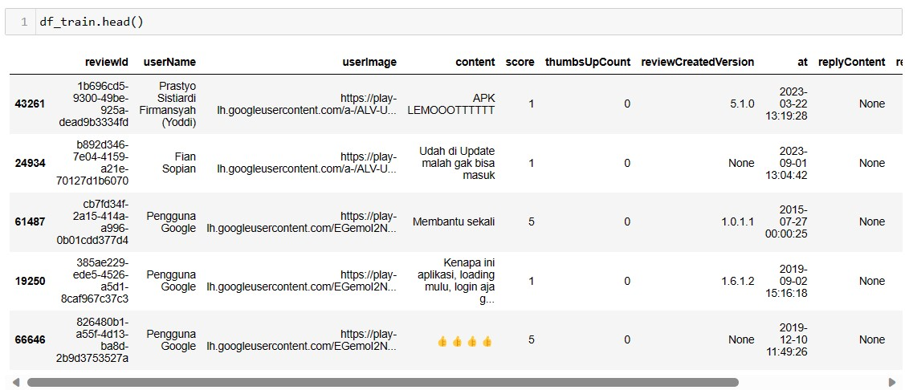

I scraped the data myself using Python’s `google_play_scraper` library and obtained 66714 rows of reviews. Then I split the data blindly into training and testing subsets, you can access the data here [link github]. Every model-building step will occur using the training data, and the testing data is dedicated to checking the final predictive power.

.png)

For your information, KAI Access is the official application for the railway network in my home country, Indonesia, and *yes* the application has a pretty low rating :)

## Applying proposed algorithm

Defining custom function for building a dictionary out of training data:

```python
def build_vocab(texts):
    sentences = texts.apply(lambda x: x.split()).values
    vocab = {}
    for sentence in sentences:
        for word in sentence:
            try:
                vocab[word] += 1
            except KeyError:
                vocab[word] = 1
    return vocab
```

First pass, creating a Double Metaphone mapping to the training data dictionary. The output preview is as follows:

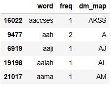

For the second pass, I used R Studio as the main tool. Since there exists the `stringdist` library in R, unfortunately, I could not find a similar library in Python.

```r
library(stringdist)
library(arrow)
library(tidyverse)
library(data.table)

# data loading
df_train_vocab <- read_parquet('df_train_vocab.parquet')

# similar to list comprehension
li_corrected <- lapply(unique(df_train_vocab$dm_map), function(x) {
  temp_sel <- df_train_vocab %>% 
    filter(dm_map == !!x) %>% 
    arrange(desc(freq))
  if (nrow(temp_sel) > 1 & !all(temp_sel$freq == 1)) {
    temp_mat <- temp_sel %>% 
      pull(word) %>% 
      stringsimmatrix(method = 'cosine')
    word_correction <- temp_sel %>% 
      slice_max(order_by = freq, with_ties = FALSE) %>% 
      pull(word)
    temp_sel$sim <- temp_mat[1,]
    temp_sel <- temp_sel %>% 
      mutate(correction = if_else(sim >= .65, word_correction, word))
    return(temp_sel)
  }
})

# discard nulls then concat the results
li_corrected <- li_corrected[!sapply(li_corrected, is.null)]
df_corrected <- rbindlist(li_corrected)

# export and load it back to Python
write_parquet(df_corrected, 'df_train_corrected.parquet')
```

At a glance, the constructed correction dictionary seems promising. However, when I take a look deeper at it, things may not be as good as it seems. Here are some results, the good, so-so, and bad ones.

Good result, everything was corrected properly.

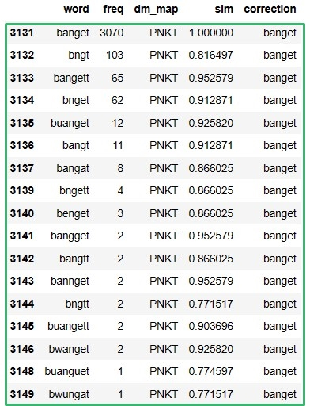

So-so result, most of it is corrected properly, but there are some mistakes.

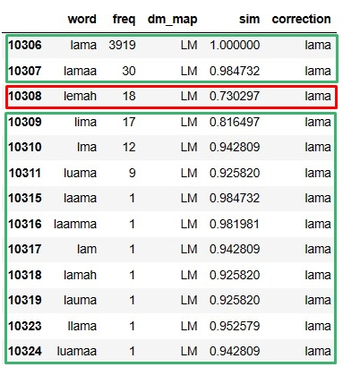

Bad result, as bad as it sounds.

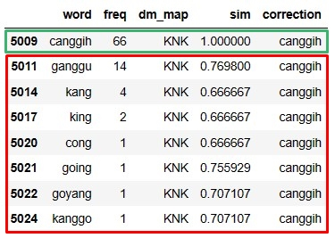

Anyway, let’s proceed to the final step which is defining the function to process the “correction” step:

```python
df_correction = pd.read_parquet('df_train_corrected.parquet')

def word_correction(string):

    li_string = string.split()

    for i, word in enumerate(li_string):
        mask = df_correction['word'] == word
        if any(mask):
            corrected_word = df_correction.loc[mask, 'correction'].values[0]
            li_string[i] = corrected_word

    corrected_string = ' '.join(li_string)

    return corrected_string
```

Note that the above code is considerably slow and inefficient, so any suggestion to make it faster would be greatly appreciated :)

## Data preprocessing

Splitting training data into another training and validation subset. After that, I defined another custom function to the text preprocessing step, but it wasn’t originated from me though, thanks to Qing Liu at [Kaggle](https://www.kaggle.com/code/sunnymarkliu/more-text-cleaning-to-increase-word-coverage) who had shared the code! Since the code is too long to share here, you can find it on my repo here[link github].

```python
from sklearn.model_selection import train_test_split

X = df_train.drop('bad_rating', axis=1)
Y = df_train.bad_rating
X_train, X_test, Y_train, Y_test = train_test_split(
    X, Y, test_size=.2, random_state=69)

target_classes = ['no', 'yes']
classes = np.unique(Y_train)
mapping = dict(zip(classes, target_classes))

def preprocess(text):

    text = text.lower()
    text = convert_emoji_to_text(text)
    text = remove_space(text)
    text = clean_special_punctuations(text)
    text = clean_number(text)
    text = remove_punctuation(text)
    text = remove_elongation(text)
    text = remove_space(text)

    return text
```

So, to test the effectiveness, I differentiated the preprocessing steps into 3 approaches.

| Preprocessing steps | Detail |
| --- | --- |
| No preprocessing | That’s it, just the raw data |
| Standard preprocessing | Using preprocess function and nlp_id’s Lemmatizer |
| Proposed preprocessing | Using preprocess function, nlp_id’s Lemmatizer and in-house word correction dictionary |

The next step is to plugging the preprocessed data into tokenizer and GloVe embedder. Again, because the code is too long, you can find the full code in my repo.

## Model training

I used keras deep learning as the base model, here is a glimpse of the code and the model.

```python
from tensorflow import reduce_sum
from keras.models import Model
from keras.layers import Dense, Embedding, Input

inputs = Input(shape=(max_tokens, ))
embeddings_layer = Embedding(input_dim=len(tokenizer_np.index_word) + 1,
                             output_dim=embed_len,
                             input_length=max_tokens,
                             trainable=False,
                             weights=[word_embeddings_np])
dense1 = Dense(128, activation="relu")
dense2 = Dense(64, activation="relu")
dense3 = Dense(len(target_classes), activation="softmax")

x = embeddings_layer(inputs)
x = reduce_sum(x, axis=1)
x = dense1(x)
x = dense2(x)
outputs = dense3(x)

model_np = Model(inputs=inputs, outputs=outputs)
```

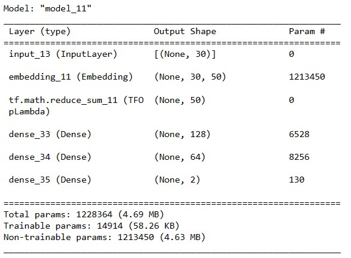

## Evaluation

After doing the works, finally the results came. Here it is.

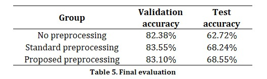

First of all, yes indeed the model is overfitted. There was a slight increase in accuracy between the standard and my proposed algorithm test result, though the validation accuracy did not support the same outcome. Nonetheless, when it comes to machine learning analysis, there are lots of things that affect its outcome. Thus, a slight improvement in accuracy already means a lot in this particular project of mine :)

# Closing thoughts

The goal of this project is to demonstrate my idea of proposing a new algorithm and then to validate whether it is viable or not to be researched further in the future (or for “my” future). I think the algorithm's main framework is pretty solid already, it just needs more perseverance and determination to compile it. With a simple text classification prediction analysis, it was found that there is a slight increase in accuracy. I called it a mini victory rather than a failure though, since this project is done in less than a month. I expect with lots of diligent work, it should improve even more!

## Future works

This is not the end though, this is the start of another future work that is inspired from this! I’ve been thinking of what might work well with this algorithm, so here are the lists:

- Improving first pass mapping’s result with fancier statistical technique, also adding more variables sound goods
- Adapting the ElasticSearch indexing method to develop in-house string similarity measures
- Expanding word coverage with a larger corpus
- Experimenting with another fuzzy string matching approaches to establish an ensemble method
- Optimizing code for preprocessing function to make it faster

---

# References

[1] M. Starr. “Can our brains really read jumbled words as long as the first and last letters are correct?” ScienceAlert. Accessed: Dec. 19, 2023. [Online]. Available: [https://www.sciencealert.com/word-jumble-meme-first-last-letters-cambridge-typoglycaemia](https://www.sciencealert.com/word-jumble-meme-first-last-letters-cambridge-typoglycaemia)

[2] Author. “Fuzzy name matching techniques.” Babel Street. Accessed: Dec. 19, 2023. [Online]. Available: [https://www.babelstreet.com/blog/fuzzy-name-matching-techniques](https://www.babelstreet.com/blog/fuzzy-name-matching-techniques)

[3] N. Aliyah Salsabila, Y. Ardhito Winatmoko, A. Akbar Septiandri, and A. Jamal, “Colloquial indonesian lexicon”, in *2018 Int. Conf. Asian Lang. Process. (IALP)*, Bandung, Indonesia, Nov. 15–17, 2018. IEEE, 2018. Accessed: Nov. 23, 2023. [Online]. Available: [https://doi.org/10.1109/ialp.2018.8629151](https://doi.org/10.1109/ialp.2018.8629151)

[4] Author. “String similarity — Phonological CorpusTools 1.5.1 documentation.” Welcome to Phonological CorpusTools’s documentation! — Phonological CorpusTools 1.5.1 documentation. Accessed: Dec. 10, 2023. [Online]. Available: [https://corpustools.readthedocs.io/en/stable/string_similarity.html](https://corpustools.readthedocs.io/en/stable/string_similarity.html)

[5] Varun. “Cosine similarity: How does it measure the similarity, Maths behind and usage in Python.” Towards Data Science. Accessed: Dec. 10, 2023. [Online]. Available: [https://towardsdatascience.com/cosine-similarity-how-does-it-measure-the-similarity-maths-behind-and-usage-in-python-50ad30aad7db](https://towardsdatascience.com/cosine-similarity-how-does-it-measure-the-similarity-maths-behind-and-usage-in-python-50ad30aad7db)

[6] D. L. Pennell and Y. Liu, “Normalization of informal text”, *Comput. Speech & Lang.*, vol. 28, no. 1, pp. 256–277, Jan. 2014. Accessed: Dec. 16, 2023. [Online]. Available: [https://doi.org/10.1016/j.csl.2013.07.001](https://doi.org/10.1016/j.csl.2013.07.001)

[7] A. Doan, A. Halevy, and Z. Ives, “String matching”, in *Principles of Data Integration*. Elsevier, 2012, pp. 95–119. Accessed: Dec. 16, 2023. [Online]. Available: [https://doi.org/10.1016/b978-0-12-416044-6.00004-1](https://doi.org/10.1016/b978-0-12-416044-6.00004-1)
